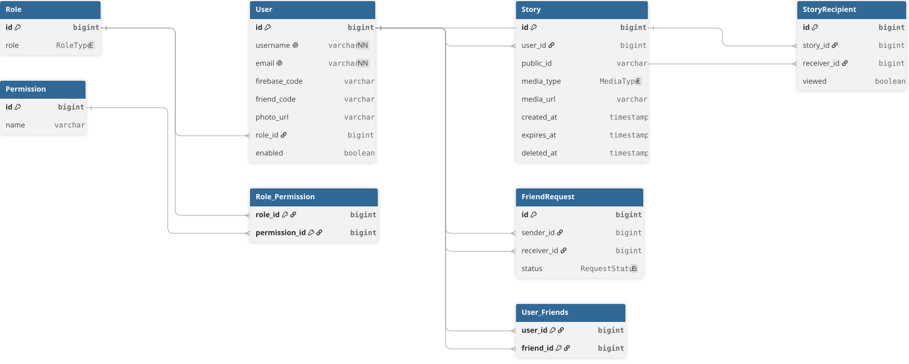
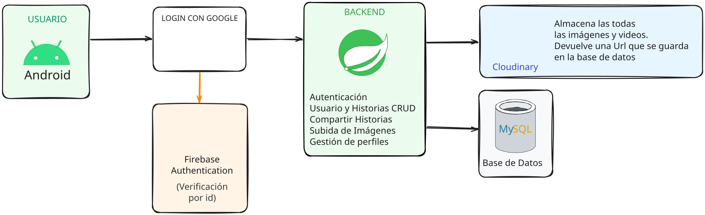

# 🔐 DualShare Backend

Backend REST de **DualShare**, una aplicación móvil para compartir historias e imágenes entre usuarios.

El backend se encarga de la autenticación, gestión de usuarios, historias, destinatarios y almacenamiento de imágenes, utilizando **Spring Boot**, **Firebase Authentication**, **MySQL** y **Cloudinary**.

---

## ✨ Características

* 🔑 Inicio de sesión con Google mediante Firebase Authentication.
* 🛡️ Verificación de Firebase ID Tokens.
* 👤 Registro automático de usuarios.
* 👥 Gestión de usuarios.
* 📖 Creación y consulta de historias.
* 🔗 Compartir historias con otros usuarios.
* 🖼️ Subida de imágenes mediante Cloudinary.
* 🌐 API REST.
* 🗄️ Persistencia de datos con MySQL.
* 🐳 Contenedorización con Docker.

---

## 🛠️ Tecnologías

| Tecnología            | Utilización                |
| --------------------- | -------------------------- |
| ☕ Java 21             | Lenguaje principal         |
| 🌱 Spring Boot        | Desarrollo del backend     |
| 🔐 Spring Security    | Seguridad de la API        |
| 🗃️ Spring Data JPA   | Persistencia               |
| ⚙️ Hibernate          | ORM                        |
| 🐬 MySQL              | Base de datos              |
| 🔥 Firebase Admin SDK | Autenticación              |
| ☁️ Cloudinary         | Almacenamiento de imágenes |
| 🐳 Docker             | Contenedorización          |
| 📦 Maven              | Gestión del proyecto       |

---

## 🏗️ Arquitectura

La aplicación está organizada utilizando una arquitectura por capas, separando la exposición de la API, la lógica de negocio, la persistencia y las integraciones externas.


### Flujo general

```text
┌──────────────────┐
│  Aplicación      │
│     Android      │
└────────┬─────────┘
         │
         │ HTTP / REST
         ▼
┌──────────────────┐
│    Controller    │
└────────┬─────────┘
         │
         ▼
┌──────────────────┐
│     Service      │
│  Lógica negocio  │
└────────┬─────────┘
         │
    ┌────┴─────┐
    ▼          ▼
┌─────────┐ ┌──────────────┐
│Repository│ │  Servicios   │
│          │ │   externos   │
└────┬────┘ └──────┬───────┘
     │             │
     ▼        ┌────┴─────────────┐
  MySQL       │                  │
              ▼                  ▼
          Firebase          Cloudinary
```

---

## 🗃️ Modelo de datos

El modelo de datos representa las principales relaciones entre usuarios, historias y los usuarios con quienes se comparten.



---

## 🔐 Flujo de autenticación

La autenticación utiliza **Google** junto con **Firebase Authentication**.

```text
┌──────────────┐
│   Android    │
└──────┬───────┘
       │
       │ Inicio de sesión
       ▼
┌──────────────┐
│   Firebase   │
│ Authentication│
└──────┬───────┘
       │
       │ ID Token
       ▼
┌──────────────┐
│   Backend    │
│  DualShare   │
└──────┬───────┘
       │
       │ Verificación
       ▼
┌──────────────┐
│    Firebase  │
│  Admin SDK   │
└──────┬───────┘
       │
       ▼
┌──────────────┐
│    MySQL     │
└──────────────┘
```

### Proceso

1. El usuario inicia sesión con Google desde la aplicación Android.
2. Firebase Authentication genera un **ID Token**.
3. La aplicación envía el token al backend.
4. Firebase Admin SDK verifica la validez del token.
5. Se obtiene la información del usuario autenticado.
6. Si el usuario todavía no existe, se registra automáticamente.
7. El backend continúa con la operación solicitada.

---

## 🖼️ Flujo de subida de imágenes

Las imágenes se almacenan en **Cloudinary**, mientras que la base de datos conserva la URL correspondiente.

```text
┌──────────────┐
│   Android    │
└──────┬───────┘
       │
       │ Imagen
       ▼
┌──────────────┐
│   Backend    │
└──────┬───────┘
       │
       │ Subida
       ▼
┌──────────────┐
│  Cloudinary  │
└──────┬───────┘
       │
       │ URL
       ▼
┌──────────────┐
│    MySQL     │
└──────────────┘
```

Este enfoque evita almacenar directamente los archivos dentro de la base de datos.

---

## 🔄 Arquitectura del sistema



La aplicación Android se comunica con el backend mediante una API REST. El backend centraliza la lógica de negocio y se comunica con los servicios externos necesarios.

```text
                    ┌─────────────────┐
                    │ DualShare       │
                    │ Android         │
                    └────────┬────────┘
                             │
                             │ REST API
                             ▼
                    ┌─────────────────┐
                    │ DualShare       │
                    │ Backend         │
                    └───────┬─────────┘
                            │
              ┌─────────────┼─────────────┐
              │             │             │
              ▼             ▼             ▼
          ┌───────┐    ┌──────────┐  ┌───────────┐
          │ MySQL │    │ Firebase │  │ Cloudinary│
          └───────┘    └──────────┘  └───────────┘
```

---

## 📁 Estructura del proyecto

```text
src
├── config
├── controller
├── dto
├── exception
├── mapper
├── model
├── repository
├── security
├── service
└── util
```

### Responsabilidades principales

**`controller`**
Expone los endpoints REST de la aplicación.

**`service`**
Contiene la lógica de negocio.

**`repository`**
Gestiona el acceso a la base de datos mediante Spring Data JPA.

**`security`**
Contiene la configuración de seguridad y la validación de Firebase.

**`dto`**
Define los objetos utilizados para la comunicación mediante la API.

**`mapper`**
Se encarga de las conversiones entre DTOs y modelos.

**`exception`**
Centraliza el manejo de excepciones de la aplicación.

**`config`**
Contiene las configuraciones necesarias para el funcionamiento e integración de los servicios externos.

---

## ⚙️ Variables de entorno

Las credenciales y configuraciones sensibles se manejan mediante variables de entorno.

```env
SPRING_DATASOURCE_URL=
SPRING_DATASOURCE_USERNAME=
SPRING_DATASOURCE_PASSWORD=

CLOUDINARY_CLOUD_NAME=
CLOUDINARY_API_KEY=
CLOUDINARY_API_SECRET=

FIREBASE_PROJECT_ID=
FIREBASE_CLIENT_EMAIL=
FIREBASE_PRIVATE_KEY=
```

> 🔒 Las credenciales privadas no deben almacenarse directamente en el repositorio.

---

## 🚀 Instalación

### Requisitos

Antes de ejecutar el proyecto es necesario tener instalado:

* ☕ Java 21
* 📦 Maven
* 🐬 MySQL

Opcionalmente:

* 🐳 Docker
* Docker Compose

### 1. Clonar el repositorio

```bash
git clone https://github.com/Emir201G/dualshare-backend.git
```

### 2. Entrar al proyecto

```bash
cd dualshare-backend
```

### 3. Configurar las variables de entorno

Configurar las credenciales correspondientes a:

* MySQL
* Firebase
* Cloudinary

### 4. Ejecutar con Maven

```bash
mvn spring-boot:run
```

### 5. Ejecutar con Docker

```bash
docker compose up
```

---

## 🌐 Endpoints principales

### 🔐 Autenticación

| Método | Endpoint           | Descripción                   |
| ------ | ------------------ | ----------------------------- |
| `POST` | `/api/auth/verify` | Verifica el Firebase ID Token |

### 👤 Usuarios

| Método | Endpoint          | Descripción          |
| ------ | ----------------- | -------------------- |
| `GET`  | `/api/users`      | Obtiene los usuarios |
| `GET`  | `/api/users/{id}` | Obtiene un usuario   |
| `PUT`  | `/api/users/{id}` | Actualiza un usuario |

### 📖 Historias

| Método   | Endpoint            | Descripción           |
| -------- | ------------------- | --------------------- |
| `POST`   | `/api/stories`      | Crea una historia     |
| `GET`    | `/api/stories`      | Obtiene las historias |
| `DELETE` | `/api/stories/{id}` | Elimina una historia  |

### 🔗 Compartir historias

| Método | Endpoint                | Descripción                              |
| ------ | ----------------------- | ---------------------------------------- |
| `POST` | `/api/story-recipients` | Comparte una historia con otros usuarios |

---

## 📱 Proyecto relacionado

### DualShare Android

Aplicación Android que consume la API de este backend.

🔗 **[Repositorio de DualShare Android](https://github.com/Emir201G/dualshare-android)**

---

## 📚 Documentación

Los diagramas utilizados para documentar el proyecto se encuentran en:

```text
doc/
├── architecture.png
├── database-er.svg
└── arquitectura-dualshare.svg
```

---

## 📌 Estado del proyecto

🟢 **Finalizado**

DualShare fue desarrollado como proyecto backend para aplicar conceptos de desarrollo de APIs REST, autenticación, persistencia de datos, almacenamiento de archivos e integración con servicios externos.

---

## 👨‍💻 Autor

### Emir Guanactolay

**Backend Developer**

`Java` · `Spring Boot` · `Spring Security` · `JPA` · `MySQL` · `Docker`

🔗 **[GitHub](https://github.com/Emir201G)**
